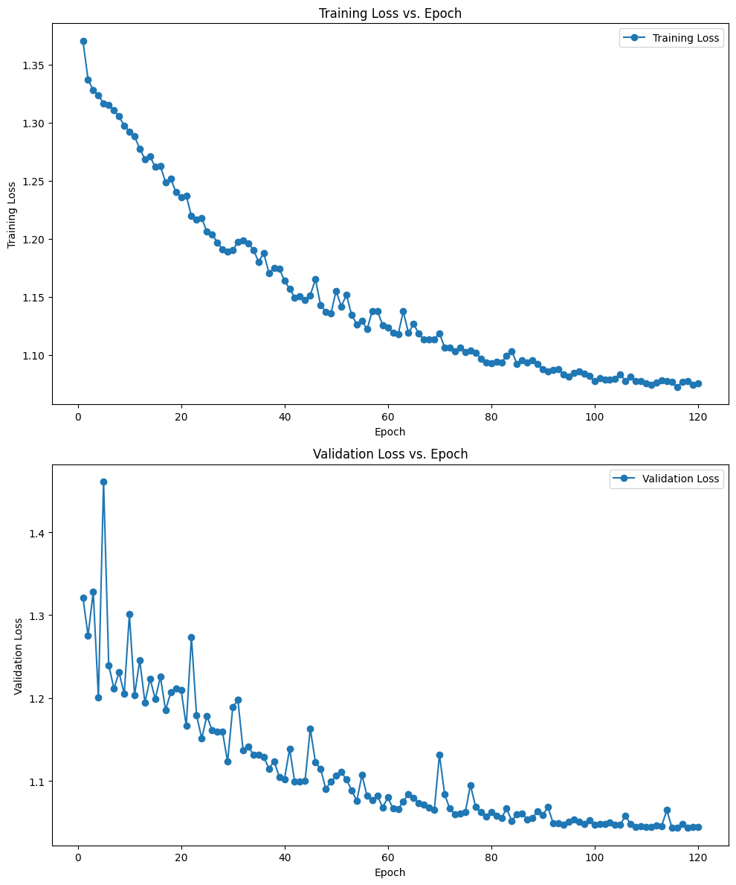
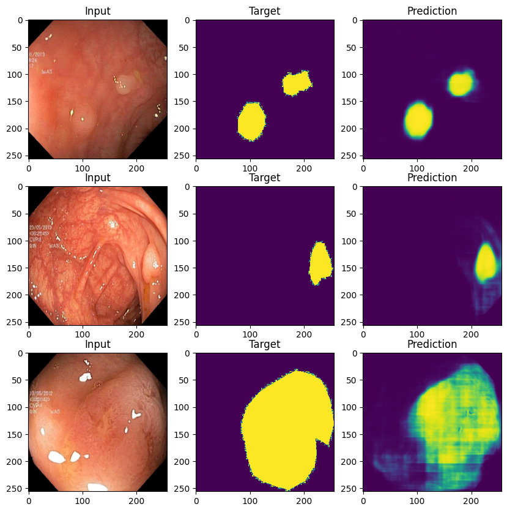

# Gastrointestinal Polyp Segmentation

*What is Polyp and why segmentation is needed?*
- Gastrointestinal polyps are growths of tissue in the inner lining of the stomach. They are usually found incidentally during an upper endoscopy. While they are generally benign, they can potentially develop into cancer.
- Research in this field has the potential to help reduce the polyp miss rate and thus improve examination quality.

## Data

Dataset: Kvasir-SEG dataset\
Source : https://datasets.simula.no/kvasir-seg/

Contains 1000 polyp images and their corresponding ground truth.

## Architecture
Used a simple U-net, with 3-channel input and 1-channel output. Check [notebook](./notebook/model.ipynb) for the model arch.\
Architecture based on paper : https://arxiv.org/pdf/1505.04597.pdf

## Training
Trained for 120 epochs. Check [Notebook](./notebook/polyp-segmentation.ipynb) for whole training in PyTorch.\
Criterion - DiceLoss\
Optimizer - Adam

## Results

Loss on test Data - \
Dice Loss: **1.0509**\
IoU Loss: **1.0000**\
BCE Loss: **0.0509**

### Predictions-

## TODO